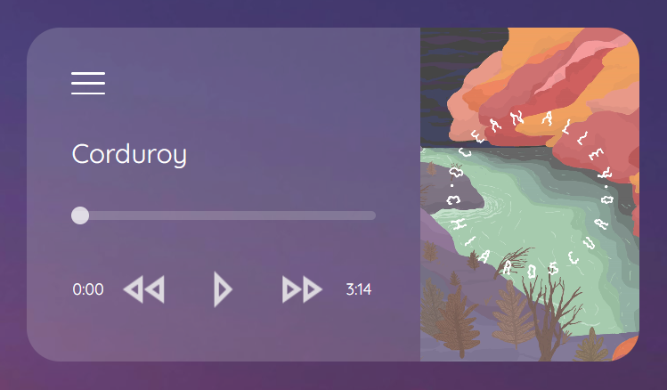
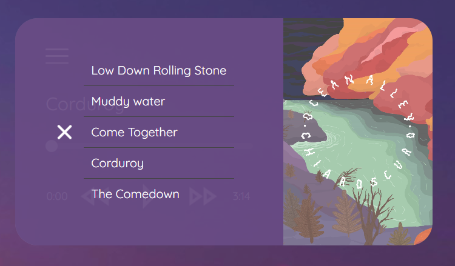

# 🎸 PlayMusic 🎸

## 📜 Sobre el proyecto 

Se trata de un reproductor de música dinámico y minimalista que ofrece una experiencia intuitiva y visualmente atractiva 

## 🛠️ Stack 

   

## Funcionamiento

1. **Reproducción y control de música** ⏯️ 
   - Inicia, pausa y cambia canciones fácilmente con los botones de control.
   - La barra de progreso permite navegar rápidamente dentro de una pista.

2. **Lista de canciones interactiva** 📋  

   - Las canciones se generan dinámicamente en la interfaz.
   - Permite seleccionar una canción específica desde la lista.

3. **Carátula del álbum** 🎴

   - Cada canción tiene una imagen de carátula que cambia automáticamente.

4. **Diseño responsivo y visualmente atractivo** 🖼️
   - Fondo animado con un diseño minimalista.
   - Interfaz adaptable a diferentes tamaños de pantalla.

## Futuras mejoras 

- 🚀 Integración con APIs de Música : Añadir canciones desde servicios en línea como Spotify o YouTube.

- 📂 Carga de Archivos Personalizados : Permitir al usuario subir sus propias canciones.

- 🎨 Temas Personalizables : Opciones de colores y temas oscuros/claros.

- 🌍 Multilenguaje : Compatibilidad con múltiples idiomas.

- 🛠️ Perfeccionar algunos elementos

## Instalación y uso

1. Clona el repositorio:
   git clone https://github.com/usuario/A.G.V.PlayMusic.git

## 📭 Contacto 

 

